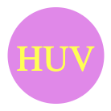
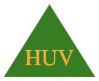
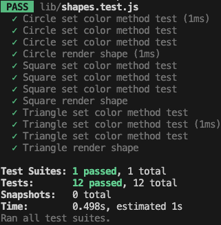

# SVG-Logo-Maker

[YouTube: Video Demonstration PLACEHOLDER - CHANGE THIS LINK!!!](https://youtu.be/g7lJFkv_omw)

## Desktop Application

## Description

The SVG Logo Maker is a Node.js command-line application built with Object-oriented Programming principles. It allows freelance web developers to create simple logos for their projects without relying on a graphic designer.

Users can input text (up to three characters), select text and shape colors using color keywords or hexadecimal numbers, and choose from shapes including circle, triangle, and square. Upon completing the prompts, the application generates an SVG file named logo.svg and displays "Generated logo.svg" in the command line.

The application employs Jest for running unit tests to ensure accuracy and reliability, with each shape class tested for a render() method that returns a string for the corresponding SVG file with the given shape color. Input collection is facilitated by the Inquirer library, providing a seamless user experience.

## Table of Contents

- [SVG Logo Maker](#svg-logo-maker) 
- [Desktop Application](#desktop-application) 
- [Description](#description) 
- [Table of Contents](#tabel-of-contents) 
- [User Story](#user-story) 
- [Acceptance Criteria](#acceptance-criteria) 
- [Installation](#instllation) 
- [Development](#development) 
- [Usage](#usage) 
- [Technologies](Technologies)
- [License](#license) 
- [Contributing](#contributing) 
- [Tests](#tests) 
- [Questions/Contact](#questionscontact)

## User Story

**AS A** a freelance web developer  

**I WANT** to generate a simple logo for my projects  

**SO THAT** I don't have to pay a graphic designer

## Acceptance Criteria

**GIVEN** a command-line application that accepts user input

**WHEN** I am prompted for text  
**THEN** I can enter up to three characters

**WHEN** I am prompted for the text color  
**THEN** I can enter a color keyword (OR a hexadecimal number)

**WHEN** I am prompted for a shape  
**THEN** I am presented with a list of shapes to choose from: circle, triangle, and square

**WHEN** I am prompted for the shape's color  
**THEN** I can enter a color keyword (OR a hexadecimal number)

**WHEN** I have entered input for all the prompts  
**THEN** an SVG file is created named `logo.svg`
**AND** the output text "Generated logo.svg" is printed in the command line

**WHEN** I open the `logo.svg` file in a browser  
**THEN** I am shown a 300x200 pixel image that matches the criteria I entered

## Installation

git clone https://github.com/theoarsman/svg-logo-maker.git

Clone the repository: `cd svg-logo-maker`

Navigate to the project directory: `npm install`

Install dependencies using npm: `npm install`

## Development

To contribute to the SVG Logo Maker, follow these steps:

Fork the repository on GitHub.
Clone your forked repository: `git clone https://github.com/yourusername/svg-logo-maker.git`

Navigate to the project directory: `cd svg-logo-maker`

Install dependencies using npm: `npm install`

Make changes to the codebase and add tests to cover new functionalities or fixes.
Ensure all tests pass by running: `npm test`

Submit a pull request detailing your changes.

## Usage

To use the SVG Logo Maker, follow these steps:

Install the package globally via npm: `npm install -g svg-logo-maker`

Run the application in your terminal: `svg-logo-maker`

Follow the prompts to select a shape, color, and text for your logo.
After completing the prompts, the SVG file will be generated with the specified configurations.

## Technologies

## License

MIT License

Copyright 2024 Heinz Ulrich V

Permission is hereby granted, free of charge, to any person obtaining a copy
of this software and associated documentation files (the "Software"), to deal
in the Software without restriction, including without limitation the rights
to use, copy, modify, merge, publish, distribute, sublicense, and/or sell
copies of the Software, and to permit persons to whom the Software is
furnished to do so, subject to the following conditions:

The above copyright notice and this permission notice shall be included in all
copies or substantial portions of the Software.

THE SOFTWARE IS PROVIDED "AS IS", WITHOUT WARRANTY OF ANY KIND, EXPRESS OR
IMPLIED, INCLUDING BUT NOT LIMITED TO THE WARRANTIES OF MERCHANTABILITY,
FITNESS FOR A PARTICULAR PURPOSE AND NONINFRINGEMENT. IN NO EVENT SHALL THE
AUTHORS OR COPYRIGHT HOLDERS BE LIABLE FOR ANY CLAIM, DAMAGES OR OTHER
LIABILITY, WHETHER IN AN ACTION OF CONTRACT, TORT OR OTHERWISE, ARISING FROM,
OUT OF OR IN CONNECTION WITH THE SOFTWARE OR THE USE OR OTHER DEALINGS IN THE
SOFTWARE.

## Contributing

N/A

## Tests

### Testing Framework and Dependencies

This project uses Jest as the testing framework. To run tests, execute `npm test` in the terminal. Ensure you have Node.js installed and dependencies installed by running `npm install`.

### Test Coverage

The test suite achieves 100% code coverage, ensuring comprehensive testing of the project's functionality. Test coverage is measured using Jest's built-in coverage reporting tools.

### Test Environment Setup

To set up the test environment locally, follow these steps:

1. Install Node.js: [Node.js Installation Guide](https://nodejs.org/en/download/)
2. Clone the repository: `git clone https://github.com/yourusername/svg-logo-maker.git`
3. Navigate to the project directory: `cd svg-logo-maker`
4. Install dependencies: `npm install`

### Test Descriptions

#### Circle

- **Circle set color method test**: Tests the setTextColor() method of the Circle class.
- **Circle set color method test**: Tests the setShapeColor() method of the Circle class.
- **Circle set color method test**: Tests the setTextType() method of the Circle class.
- **Circle render shape**: Tests the render() method of the Circle class for rendering SVG with specified parameters.

#### Square

- **Square set color method test**: Tests the setTextColor() method of the Square class.
- **Square set color method test**: Tests the setShapeColor() method of the Square class.
- **Square set color method test**: Tests the setTextType() method of the Square class.
- **Square render shape**: Tests the render() method of the Square class for rendering SVG with specified parameters.

#### Triangle

- **Triangle set color method test**: Tests the setTextColor() method of the Triangle class.
- **Triangle set color method test**: Tests the setShapeColor() method of the Triangle class.
- **Triangle set color method test**: Tests the setTextType() method of the Triangle class.
- **Triangle render shape**: Tests the render() method of the Triangle class for rendering SVG with specified parameters.

### Test Results

This structure provides a clear breakdown of each test along with the test results. Users can quickly understand what each test does and verify the test outcomes.

## Questions/Contact

**Developer:** Heinz Ulrich V

 

 

 

